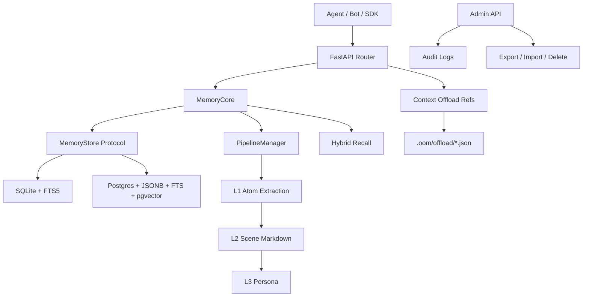
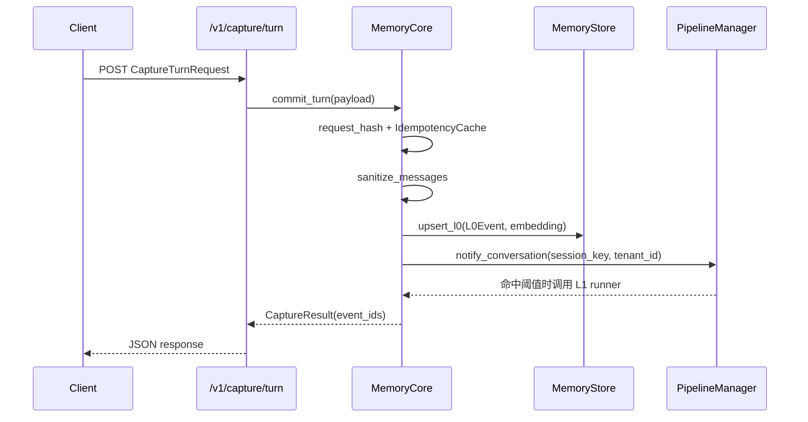
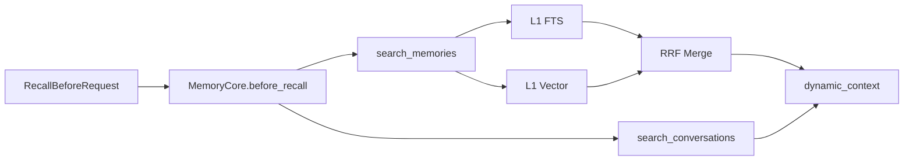

# Only-One-Memory 代码观看指南

## 1. 这次到底在看什么

如果只看目录，OOM 像一个 FastAPI 小服务；但按运行时视角看，它更像一个 **独立于 Agent 框架之外的长期记忆 Runtime**。它接收外部 Agent 的 turn，把原始对话沉淀为 L0 证据，再逐层提炼为 L1 原子记忆、L2 场景、L3 画像，同时提供召回、搜索、导入导出、删除、审计和上下文卸载。

这份指南要解释的是：**一次外部请求如何经过 HTTP 适配层进入 MemoryCore，再落到 Store 和 Pipeline，最后变成可追溯、可召回的长期记忆。**

## 2. 一句话系统判断

OOM 的重心不是“把文本存进数据库”，而是把 **记忆分层、证据追溯、存储适配、后台抽取、上下文卸载** 这些边界显式化。读代码时不要按文件夹顺序平铺读，而要沿着“入口、业务核心、状态、存储、管线、证据恢复”六条主线看。

## 3. 先建立全局地图

## 4. 最值得盯住的主线

### 4.1 HTTP 只是协议适配层

- **证据**：`oom/app/main.py:15` 的 `create_app()` 只装配路由和 `/v1/metrics`。
- **证据**：`oom/app/dependencies.py:11` 的 `get_memory_core()` 为 app 复用一个 `MemoryCore`。
- **判断**：FastAPI handler 不应该承载核心记忆规则；它主要负责请求/响应、HTTP 错误和依赖注入。

建议先看：

1. `oom/app/main.py`
2. `oom/app/dependencies.py`
3. `oom/app/api/capture.py`
4. `oom/app/api/recall.py`
5. `oom/app/api/offload.py`

### 4.2 MemoryCore 是稳定业务入口

- **证据**：`oom/memory_core/core.py:38` 定义 `MemoryCore`。
- **证据**：`oom/memory_core/core.py:74` 的 `commit_turn()` 写 L0 并通知 pipeline。
- **证据**：`oom/memory_core/core.py:144` 的 `before_recall()` 同时查询 L1 与 L0，再组装动态上下文。
- **判断**：外层不需要知道 SQLite/Postgres、FTS/vector、checkpoint 或 pipeline 细节；这些都被 MemoryCore 收敛。

最重要的阅读顺序：

1. `initialize()` / `close()`：理解生命周期和 checkpoint。
2. `commit_turn()`：理解 L0 写入和幂等。
3. `search_memories()` / `_search_l1_hybrid()`：理解混合召回。
4. `_run_l1_for_session()`：理解最小 L1 pipeline。

### 4.3 数据模型表达了记忆分层

- **证据**：`oom/memory_core/types.py:33` 的 `CaptureTurnRequest` 是采集入口。
- **证据**：`oom/memory_core/types.py:97` 的 `MemoryAtom` 是 L1 原子记忆，保留 `source_event_ids`。
- **证据**：`oom/memory_core/types.py:168` 的 `SceneBlock` 是 L2 场景块。
- **证据**：`oom/memory_core/offload/types.py:55` 的 `OffloadEntry` 是上下文里的轻量工具结果节点。
- **判断**：模型不是 DTO 堆砌，而是在代码层固定了 L0/L1/L2/L3/offload 的语义边界。

### 4.4 Store Protocol 是数据库隔离层

- **证据**：`oom/memory_core/stores/base.py:20` 定义 `MemoryStore` 协议。
- **证据**：`oom/memory_core/stores/sqlite_store.py:25` 实现本地 SQLite store。
- **证据**：`oom/memory_core/stores/postgres_store.py:44` 实现生产型 Postgres store。
- **判断**：MemoryCore 面向协议编程。SQLite 和 Postgres 都必须实现同一套能力：L0/L1 upsert、FTS/vector search、scene/profile/offload/audit、导入导出、删除。

读 Store 时建议对照读，不要一次钻进 800 行：

1. `capabilities()`：后端能力声明。
2. `upsert_l0()` / `search_l0_fts()`：原始证据层。
3. `upsert_l1()` / `search_l1_vector()`：原子记忆层。
4. `export_tenant_records()` / `delete_user_records()`：治理能力。

### 4.5 Pipeline 负责“什么时候提炼”，不是“怎么存”

- **证据**：`oom/memory_core/pipeline/manager.py:18` 的 `PipelineManager` 管理 session 状态。
- **证据**：`oom/memory_core/core.py:249` 的 `_run_l1_for_session()` 是当前接入的 L1 runner。
- **证据**：`oom/memory_core/pipeline/jobs.py:25` 的 `PipelineJobStore` 提供 Postgres worker 队列。
- **判断**：PipelineManager 是内存态调度器，PipelineJobStore 是持久化任务队列，两者解决的问题不同：一个管 session 节奏，一个管 worker 并发领取。

### 4.6 Offload 把大上下文变成可恢复引用

- **证据**：`oom/memory_core/offload/ref_store.py:14` 的 `OffloadRefStore` 将原文保存为 JSON 文件。
- **证据**：`oom/app/api/offload.py` 在读取和创建 entry 时校验 tenant/session scope。
- **判断**：offload 的核心不是压缩文本，而是把“上下文里需要知道的结构”和“需要时可恢复的原文”拆开。

### 4.7 L2/L3 是语义组织层

- **证据**：`oom/memory_core/scene/scene_extractor.py:35` 的 `SceneExtractor` 把 L1 归纳成场景 Markdown。
- **证据**：`oom/memory_core/persona/persona_generator.py:30` 的 `PersonaGenerator` 把场景压缩成 L3 persona。
- **判断**：L2/L3 是给 Agent “快速理解用户长期背景”的读物，不替代 L0/L1 证据；需要核查时仍然要下钻。

## 5. 一条真实执行链：采集一次 turn

这条链的关键点：

1. HTTP 层只把请求交给 `MemoryCore.commit_turn()`。
2. `commit_turn()` 先做幂等，重复请求直接返回缓存结果。
3. 每条 message 变成一个 `L0Event`，事件 ID 由租户、session、idempotency key 和 index 稳定生成。
4. Store 负责数据库细节：SQLite 同步 FTS 虚拟表，Postgres 同步 tsvector/pgvector 字段。
5. Pipeline 只接收“这个 session 有新对话”的信号，不关心请求来自 HTTP 还是 worker。

## 6. 一条真实执行链：回复前召回

召回链的关键点：

1. `before_recall()` 用用户当前文本同时搜 L1 和 L0。
2. L1 搜索走 `_search_l1_hybrid()`：后端支持 vector 时执行 FTS + vector + RRF；不支持时自动降级 FTS。
3. L0 命中作为证据片段补充进上下文。
4. `build_dynamic_context()` 最后把命中结果转成可注入 Agent prompt 的文本。

## 7. 状态、资源与控制边界

| 边界 | 代码位置 | 说明 |
| :--- | :--- | :--- |
| 语义模型 | `oom/memory_core/types.py` | Capture、L0、L1、L2、L3、Recall 的统一数据语言。 |
| 业务入口 | `oom/memory_core/core.py` | 对外暴露稳定能力，避免路由散落业务规则。 |
| 持久化契约 | `oom/memory_core/stores/base.py` | Store Protocol 隔离数据库差异。 |
| 本地后端 | `oom/memory_core/stores/sqlite_store.py` | 适合开发、单机和测试。 |
| 生产后端 | `oom/memory_core/stores/postgres_store.py` | 适合多租户、事务、pgvector。 |
| 运行状态 | `oom/memory_core/pipeline/manager.py` | session 计数、warmup、idle flush、L2/L3 pending。 |
| 持久任务 | `oom/memory_core/pipeline/jobs.py` | Postgres worker 队列。 |
| 大块原文 | `oom/memory_core/offload/ref_store.py` | 文件型 refs 保存工具日志/大文本。 |
| 治理面 | `oom/memory_core/admin/*` | 导入导出、删除、审计。 |

## 8. 隐含设计选择

1. **Evidence-first**：L1 的 `source_event_ids`、L2/L3 的场景导航、offload 的 `result_ref` 都在保护“摘要可下钻”。
2. **Store-agnostic**：业务层依赖 `MemoryStore` 协议，而不是直接依赖 asyncpg/aiosqlite。
3. **REST-first 但 Core-first**：HTTP 是接入方式，MemoryCore 才是稳定业务面。
4. **少配置优先**：未配置 API key 时本地开放；Store 默认 SQLite；Postgres 通过 DSN 开启。
5. **多租户隔离显式化**：关键状态和查询都携带 `tenant_id`，pipeline 内部 key 也包含 tenant。
6. **Offload 不只是压缩**：它保留可恢复 refs，让上下文轻量但不丢证据。

## 9. 从 0 到 1 的推荐阅读路线

1. **先看入口骨架**：`oom/app/main.py`、`oom/app/dependencies.py`、`oom/app/api/capture.py`。
2. **再看核心对象**：`oom/memory_core/core.py`，重点读 `commit_turn()` 和 `before_recall()`。
3. **再看数据语言**：`oom/memory_core/types.py`、`oom/memory_core/offload/types.py`。
4. **对照看两个 Store**：先读 `stores/base.py`，再分别读 SQLite/Postgres 的 L0/L1 方法。
5. **看后台演化**：`pipeline/manager.py`、`pipeline/checkpoint.py`、`pipeline/jobs.py`、`worker.py`。
6. **看语义升层**：`extraction/l1_extractor.py`、`scene/scene_extractor.py`、`persona/persona_generator.py`。
7. **看上下文卸载**：`offload/ref_store.py`、`offload/state_manager.py`、`offload/restore.py`、`app/api/offload.py`。
8. **最后看治理与运维**：`admin/export_import.py`、`admin/delete_user.py`、`docs/operations.md`、`docker/docker-compose.yml`。

## 10. 如果要调试，优先问这几个问题

1. 请求有没有真正进入 `MemoryCore`？
2. Store 后端是哪一个？`capabilities()` 返回什么？
3. 查询是否带了正确的 `tenant_id/user_id/session_key`？
4. L1 是否被 Pipeline 触发，还是还停在 L0？
5. Offload entry 的 `result_ref` 是否存在，且 scope 是否匹配？
6. 导入导出时 pipeline state 是否仍使用原始 `session_key`？

读完这条路线，你应该能把 OOM 看成一个有清晰边界的记忆 Runtime：HTTP 负责接入，MemoryCore 负责业务编排，Store 负责持久化差异，Pipeline 负责时机，L2/L3 负责语义组织，Offload 负责上下文减重但保留证据。
